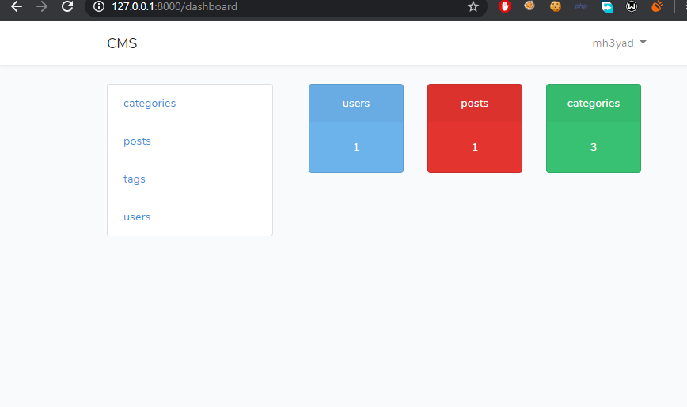
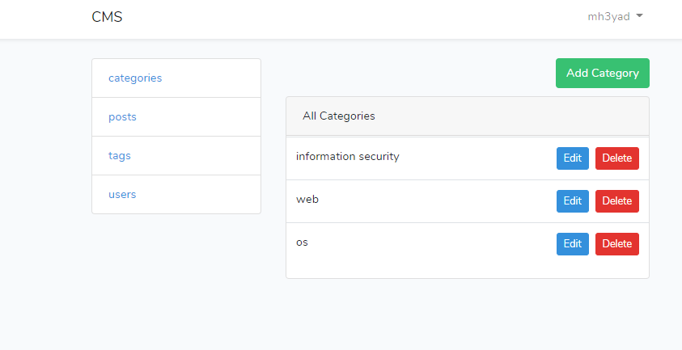
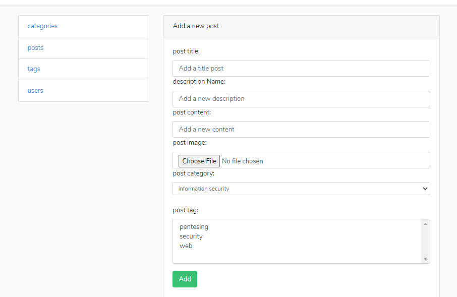
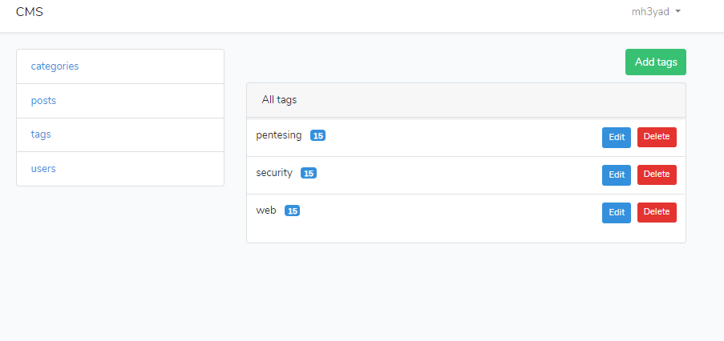

# Laravel Blog System

### Content of Project

- Authentication
- Models & Migrations
- Resource-controller and Named Routes
- Mass Assignment
- Form Request Validation
- Route Model Binding
- Relationships
- Soft Deleting
- Middleware
- File Storage
- and much more ...

## blog dashboard 

---

## blog categories 

---

## blog add new post 

---

## blog tags 

---
# LARAVEL-BLOG
